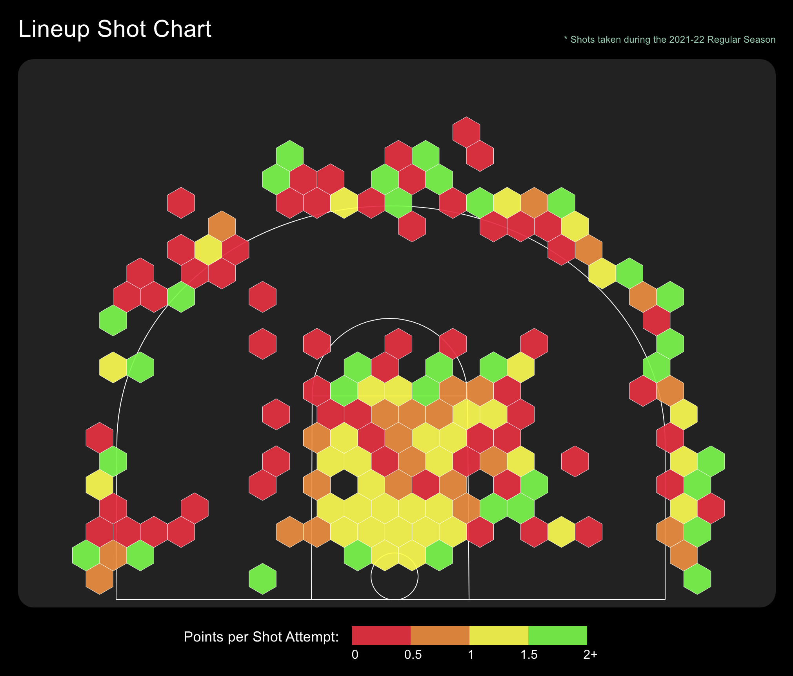

<br />
<p align='center'>
  
</p>
<br />

# Brooklyn Nets Lineup Evaluator

The Brooklyn Nets Lineup Evaluator allows users to create a lineup from the 2021-22 Nets' roster, visualize the lineup's shooting ability per location on the court, and compare their projected statistics to the league average. Built using React.js, Express, TypeScript, JavaScript, D3, Recharts, and Material UI.

View live: <a href='https://brooklyn-nets-lineup-evaluator.vercel.app/'>Brooklyn Nets Lineup Evaluator</a>

<br />

## Features:

<br />

### 1) Player Selector Sidebar

- Features the Brooklyn Nets' 2021-22 Roster
- Select up to 5 players to put into your lineup
- Highlights a player individual statistics when mouse hovers over a player


<br />
<br />

### 2) Lineup Shot Chart

- Data taken from NBA Shots DB
- Includes over 7,000 shots taken by Nets' players during the 2021-22 Regular Season
- Calculates Points per Shot Attempt for selected players in lineup (within a given location on the court)
- Displays Points per Shot Attempt data using D3 and D3-hexbin JavaScript libraries


<br />
<br />

### 3) Projected Lineup Statistics

- Data taken from NBA Shots DB and Basketball Reference
- Calculates a selected lineup's Field Goal%, 3-point%, Effective Field Goal%, Assists per 100 Possessions, Offensive Rating, and Defensive Rating using data from the Nets' 2021-22 Regular Season
- Compares these statistics to the League Average from the 2021-22 NBA Regular Season
- Displays the Projected Lineup Statistics compared to the League Average in a bar chart, created with Recharts React library
- Custom Tooltip shows when mouse hovers the bar chart and displays more detailed data on a particular statistic, created using Recharts React library


<br />
<br />

## System Design


<a href='https://excalidraw.com/#json=3ct2yZcCkwp0Rq2dWTcx6,Z0SgtmPXRO6M44ausVHuXw'>View System Design in Excalidraw</a>
<br />
<br />

## Technologies Used

- Languages:  
- Frontend:
  
  
  
  
  
  
- Backend:
  
  
  
  

<br />

## Installation

1. In the backend folder, run in the terminal:

```
npm install
```

2. In the frontend folder, run in the terminal:

```
npm install
```

3. In the terminal, open Postgres by running:

```
psql
```

4. In the terminal, create user by running:

```
CREATE USER netsadmin WITH PASSWORD 'password' CREATEDB;
```

5. In the backend folder, create the database by running in the terminal:

```
npx sequelize-cli db:create
```

6. In the backend folder, migrate tables to the database by running in the terminal:

```
npx sequelize-cli db:migrate
```

7. In the backend folder, seed the database by running in the terminal:

```
npx sequelize-cli db:seed:all
```

8. In the backend folder, create a .env file with the following code:

```
PORT=8000
```

9. In backend folder, run this command in the terminal to generate a dist folder and files:

```
npm run build
```

10. In the backend folder, start the backend by running in the terminal:

```
npm run dev
```

11. In the frontend folder, create a .env file with the following code:

```
REACT_APP_BACKEND_URL=http://localhost:8000
```

12. In the frontend folder, start the frontend by running in the terminal:

```
npm start
```

13. In the browser, navigate to http://localhost:3000/

<br />

### Owen Iwamasa:

<a href='owiwamasa@gmail.com'>

</a>
<a href='https://www.linkedin.com/in/owen-iwamasa-6ab3a9166/'>

</a>
<a href='https://github.com/owiwamasa'>

</a>
